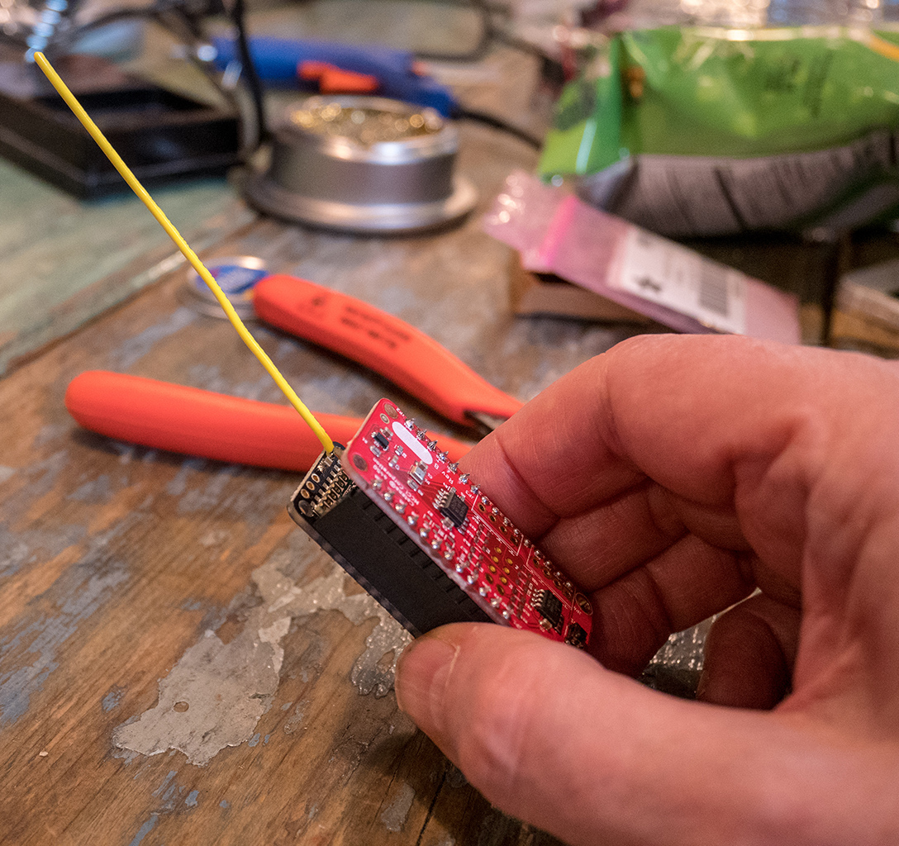

# Catena-Sketches

This repository contains top-level Arduino sketches for the Catena family of LoRaWAN&reg; technology remote sensors made by MCCI.

  

This repository is the top-level repository for the software. In order to build, you will have to download a number of additional libraries from the [MCCI Catena github page](https://github.com/mcci-catena); the repositories needed vary depending on the sketch you want to build. A bash script is provided to simplify this process.

**Contents:**
<!-- markdownlint-disable MD004 -->
<!-- markdownlint-capture -->
<!-- markdownlint-disable -->
<!-- TOC depthFrom:2 updateOnSave:true -->

- [Getting Started](#getting-started)
- [Sketch Overview](#sketch-overview)
	- [Full Sensor Programs](#full-sensor-programs)
		- [catena4450m101_sensor1](#catena4450m101_sensor1)
		- [catena4450m102_pond](#catena4450m102_pond)
		- [catena4450m102_waterlevel](#catena4450m102_waterlevel)
		- [catena4460_aqi](#catena4460_aqi)
		- [catena4460_bsec_ulp](#catena4460_bsec_ulp)
		- [catena4612_simple](#catena4612_simple)
		- [catena4617_simple](#catena4617_simple)
		- [catena4618_simple](#catena4618_simple)
		- [catena4410_sensor1](#catena4410_sensor1)
	- [Test programs](#test-programs)
		- [catena4410_test3](#catena4410_test3)
		- [catena4410_test1, catena4410_test2](#catena4410_test1-catena4410_test2)
		- [catena4450_test01](#catena4450_test01)
- [Extras](#extras)
- [Required Board-Support Packages](#required-board-support-packages)
- [Required Libraries](#required-libraries)
- [Libraries for sensor work](#libraries-for-sensor-work)
- [Related Work](#related-work)
- [Boilerplate](#boilerplate)
- [Thanks, Acknowledgments, Notes](#thanks-acknowledgments-notes)
- [Support Open Source Hardware and Software](#support-open-source-hardware-and-software)

<!-- /TOC -->
<!-- markdownlint-restore -->

## Getting Started

If you're getting started with Catenas, please check the detailed instructions at [catena4450m101_sensor/README.md](https://github.com/mcci-catena/Catena-Sketches/blob/master/catena4450m101_sensor/README.md).

## Sketch Overview

There are two kinds of sketches here:

- test programs (catena4450_test01, catena461x_hwtest, catena461x_test01, etc.), and
- full sensor programs (catena4450m101_sensor1, catena4450m102_pond, catena4460_aqi, catena4460_bsec_ulp, catena4612_simple, catena4617_simple, catea4618_simple, catena4410_sensor1).

The sketches that use LoRaWAN take advantage of the [MCCI](https://mcci.com) [arduino-lorawan](https://github.com/mcci-catena/arduino-lorawan) library to cleanly separate the application from the network transport.

Most of these sketches also use the [Catena-Arduino-Platform](https://github.com/mcci-catena/Catena-Arduino-Platform) library to provide common services and make things a little more portable.

### Full Sensor Programs

#### catena4450m101_sensor1

This is the application written for the Catena 4450 power monitoring node used in the [Ithaca Power Project](https://ithaca-power.mcci.com). It uses FRAM-based provisioning (so there is no need to edit code to change LoRaWAN keys or other settings).

#### catena4450m102_pond

This is the Tzu Chi University / Asolar Hualian research farm project sketch, upgraded for use with the Catena 4450. It uses the integrated FRAM for provisioning, auto-detects the attached sensors, and transmits data in format 0x15.

#### catena4450m102_waterlevel

This application is used by Auroville for monitring well water depth.

#### catena4460_aqi

This sketch collects and transmits air-quality information using the Bosch BME680 sensor on the MCCI Catena 4460. It transmits data in format 0x17.

#### catena4460_bsec_ulp

This sketch uses the official (but closed source) library from Bosch Sensortec for the BME680 sensor on the Catena 4460. It also transmits data in format 0x17.

#### catena4612_simple

This sketch uses the on-board sensors of the Catena 4612 (or 4610), and transmits the data to a LoRaWAN network. It doesn't support external sensors. It transmits on port 0x02, and doesn't use a format byte.

#### catena4617_simple

This sketch uses the on-board sensors of the Catena 4617, and transmits the data to a LoRaWAN network. It doesn't support external sensors. It transmits on port 0x03, and doesn't use a format byte.

#### catena4618_simple

This sketch uses the on-board sensors of the Catena 4618, and transmits the data to a LoRaWAN network. It doesn't support external sensors.  It transmits on port 0x03, and doesn't use a format byte.

#### catena4410_sensor1

This sketch is the application written for the Tzu Chi University / Asolar Hualian research farm project. One firmware image is used for a variety of sensors. You can configure a given sensor as a general purpose device or as a specific subset, referencing back to the Atmel SAMD21 CPU's unique identifier.  All provisioning is done at compile time, but the network keys and other sensitive information is placed in a special library that is outside the normal set of repositories.

The sketch transmits data in format 0x11.

### Test programs

#### catena4410_test3

This is the primary test app used when bringing up and provisioning Catena 4410 units for use with The Things Network.

#### catena4410_test1, catena4410_test2

These are simpler test programs. They were rarely used after test3 was ready, but they may be useful for test of future Catena 441x variants with different sensor configurations.

#### catena4450_test01

This is the primary (non-LoRaWAN) test sketch for the Catena 4450.

## Extras

The directory `extras` contains documentation and sample scripts for decoding the various formats.

## Required Board-Support Packages

All board support packages are maintained by MCCI. You should add the path to the reference Json file in your Arduino preferences. See the README.md for [arduino-boards](https://github.com/mcci-catena/arduino-boards) for instructions.

## Required Libraries

A number of libraries are required by this code. The top-level of this repository contains a Bash script [`git-boot.sh`](https://github.com/mcci-catena/Catena-Sketches/blob/master/git-boot.sh) that can be used to download all the libraries, using a simple database stored in a file named `git-repos.dat`. Different sketches have different needs, and so each one has its own `git-repos.dat`. For an example, see [`catena4450m101_sensor/git-repos.dat`](https://github.com/mcci-catena/Catena-Sketches/blob/master/catena4450m101_sensor/git-repos.dat).

* [MCCI's Catena Platform library](https://github.com/mcci-catena/Catena-Arduino-Platform) provides an enhanced environment for portable sketch development. It includes an command-processing framework, an elaborate persistent storage framework, encoding libraries, support for storing the persistent data from the `arduino-lorawan` library, and so forth.

* [MCCI's Arduino-LoRaWAN library](https://github.com/mcci-catena/arduino-lorawan) is a structured wrapper for the Arduino LMIC library, with the necessary hooks for interfacing to persistent storage.

* [MCCI's Ardino LMIC library](https://github.com/mcci-catena/arduino-lmic) is MCCI's fork of [The Things Network New York Arduino LMIC code](https://github.com/things-nyc/arduino-lmic).

* [MCCI's ADK](https://github.com/mcci-catena/Catena-mcciadk) is MCCI's general-purpose cross-platform "XDK" library, ported to the Arduino environment.

## Libraries for sensor work

* [MCCI's Adafruit BME280 library](https://github.com/mcci-catena/Adafruit_BME280_Library) is used to make temperature, humidity and barometric pressure measurements using the [Adafruit BME280 breakout board](https://www.adafruit.com/products/2652), which we connect via I2C. It's based on the Adafruit library, but updated so that temperature, humidity and pressure are all read at the same time, to avoid data instability.

* The [OneWire](https://github.com/mcci-catena/OneWire) and [Arduino Temperature Control Library](https://github.com/mcci-catena/Arduino-Temperature-Control-Library) are used for making measurements from Dallas-Semiconductor-based temperature sensors such as the [immersible sensor](https://www.adafruit.com/products/381) from Adafruit.

* The [Adafruit Sensor Library](https://github.com/mcci-catena/Adafruit_Sensor) and the [Adafruit TSL2561 Lux Sensor Library](https://github.com/mcci-catena/Adafruit_TSL2561) are used for making ambient light measurements with the Adafruit [TSL2561 Lux Sensor](https://www.adafruit.com/products/439)

* The [SHT1x library](https://github.com/mcci-catena/SHT1x) is used for measuring soil temperature and humidity using the Adafruit [SHT10 sensor](https://www.adafruit.com/products/1298).

* The [SHT3x library](https://github.com/mcci-catena-MCCI-Catena-SHT3x) is used for measuring temperature and humidity using the Sensirion SHT31, SHT32, or SHT35 sensors.

* The [HS300x library](https://github.com/mcci-catena/MCCI-Catena-HS300x) is used for measuring temperature and humidity using the IDT HS3001 or HS3002 sensors.

## Related Work

* [MCCI's Catena Hardware Repository](https://github.com/mcci-catena/HW-Designs) contains hardware design information and schematics.

* [MCCI's Fork of the Map The Things Arduino Sketch](https://github.com/mcci-catena/mapthethings-arduino) contains, on the MCCI-Catena branch, a port of that app supporting OTAA, using the Catena libraries.

## Boilerplate

MCCI work is released under the MIT public license. All other work from contributors (repositories forked to the MCCI Catena [github page](https://github.com/mcci-catena/)) are licensed according to the terms of those modules.

Support inquiries may be filed at [https:://portal.mcci.com](https:://portal.mcci.com) or as tickets on [github](https://github.com/mcci-catena). We are very busy, so we can't promise to help; but we'll do our best.

Commercial support is also available; contact MCCI for more information via our [support portal](https://portal.mcci.com) or our [web site](https://mcci.com).

## Thanks, Acknowledgments, Notes

Thanks to Amy Chen of Asolar, Josh Yu, and to Tzu-Chih University for funding the Hualian Garden project.

Further thanks to [Adafruit](https://www.adafruit.com/) for the wonderful Feather M0 LoRa platform, to [The Things Network](https://www.thethingsnetwork.org) for the LoRaWAN-based infrastructure, to [The Things Network New York](https://thethings.nyc) and [TTN Ithaca](https://ttni.tech) for the inspiration and support, and to the myriad people who have contributed to the Arduino and LoRaWAN infrastructure.

MCCI and MCCI Catena are registered trademarks of MCCI Corporation.

LoRa is a registered trademark of Semtech Corporation.

LoRaWAN is a registered trademark of the LoRa Alliance.

All other trademarks are the property of their respective owners.

## Support Open Source Hardware and Software

MCCI invests time and resources providing this open source code, please support MCCI and open-source hardware by purchasing products from MCCI, Adafruit and other open-source hardware/software vendors!

For information about MCCI's products, please visit [store.mcci.com](https://store.mcci.com/).
