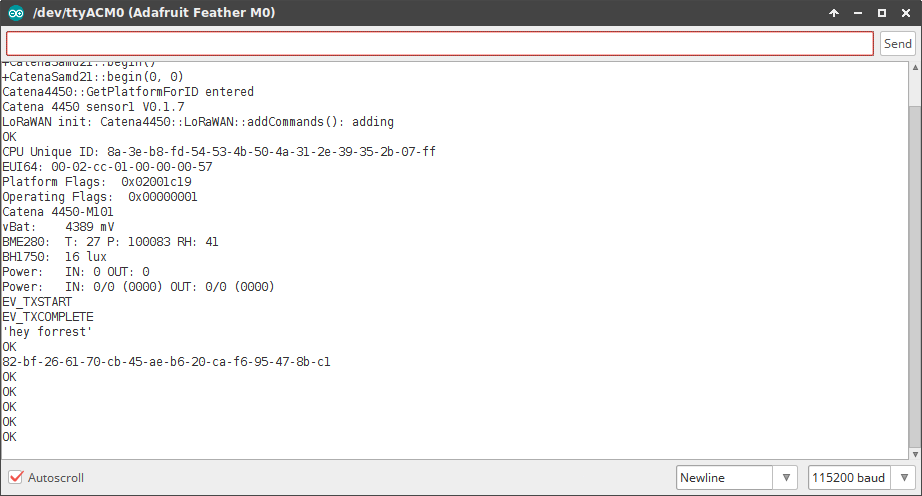

# Catena 4450 M101 Sensor Sketch
<!-- TOC depthFrom:2 -->

- [Install the MCCI SAMD board support library](#install-the-mcci-samd-board-support-library)
    - [Additional board packages required](#additional-board-packages-required)
- [Installing the required libraries](#installing-the-required-libraries)
    - [List of required libraries](#list-of-required-libraries)
- [Build and Download](#build-and-download)
- [Disabling USB Sleep (Optional)](#disabling-usb-sleep-optional)
- [Load the sketch into the Catena](#load-the-sketch-into-the-catena)
- [Provision your Catena 4450](#provision-your-catena-4450)
    - [Check platform provisioning](#check-platform-provisioning)
    - [Platform Provisioning](#platform-provisioning)
    - [LoRaWAN Provisioning](#lorawan-provisioning)
- [Notes](#notes)
    - [Data Format](#data-format)
    - [Unplugging the USB Cable while running on batteries](#unplugging-the-usb-cable-while-running-on-batteries)
    - [Deep sleep and USB](#deep-sleep-and-usb)
    - [gitboot.sh and the other sketches](#gitbootsh-and-the-other-sketches)

<!-- /TOC -->
This sketch is used for the Ithaca power project and other AC power management applications. It's also a great starting point for doing Catena 4450 work.

It is designed for use with the [Catena 4450](https://github.com/mcci-catena/HW-Designs/tree/master/kicad/Catena-4450) in conjunction with the [Adafruit Feather M0 LoRa](https://www.adafruit.com/product/3178). In order to use this code, you must do several things:

1. Install the MCCI BSP package.
3. Install the required Arduino libraries using `git`.
4. Build and download.
5. "Provision" your Catena 4450 -- this involves entering USB commands via the Arduino serial monitor to program essential identity information into the Catena 4450, so it can join the targeted network.

## Install the MCCI SAMD board support library

Go to `File>Preferences>Settings` in the Arduino IDE and add `https://github.com/mcci-catena/arduino-boards/raw/master/BoardManagerFiles/package_mcci_index.json` to the list in `Additional Boards Manager URLs`. Use a comma (`,`) to separate multiple entries if needed.

Next, open the board manager. `Tools>Board:...`, and get up to the top of the menu that pops out -- it will say d

Then go to `Tools>Board:...` and scroll to the bottom. You should see `Catena 4450`; select that.

### Additional board packages required

Due to a bug, you must install two additonal packages in order to be able to download code.

Go to Boards Manager (`Tools>Board:...>Boards Manager...`) and search for `SAM`. Install:

- **Arduino SAM Boards (32-bits ARM Cortex M3)** by **Arduino**
- **Arduino SAMD Boards (32-bits ARM Cortex M0+)** by **Arduino**


## Installing the required libraries

The script `git-boot.sh` in this directory will get all the things you need.

It's easy to run, provided you're on Windows, macOS, or Linux, and provided you have `git` installed. We tested on Windows with git bash from https://git-scm.org, on macOS 10.11.3 with the git and bash shipped by Apple, and on Ubuntu 16.0.4 LTS (64-bit) with the built-in bash and git from `apt-get install git`.

```shell
$ cd Catena4410-Sketches/catena4450m101_sensor
$ ./git-boot.sh
```

It has a number of advanced options; use `./git-boot.sh -h` to get help, or look at the source code [here](gitboot.sh).

**Beware of issue #18**.  If you happen to already have libraries installed with the same names as any of the libraries in `git-repos.dat`, `git-boot.sh` will silently use the versions of the library that you already have installed. (We hope to soon fix this to at least tell you that you have a problem.)

### List of required libraries

This sketch depends on the following libraries.

*  https://github.com/mcci-catena/Adafruit_FRAM_I2C
*  https://github.com/mcci-catena/Catena4410-Arduino-Library
*  https://github.com/mcci-catena/arduino-lorawan
*  https://github.com/mcci-catena/Catena-mcciadk
*  https://github.com/mcci-catena/arduino-lmic
*  https://github.com/mcci-catena/Adafruit_BME280_Library
*  https://github.com/mcci-catena/Adafruit_Sensor
*  https://github.com/mcci-catena/RTCZero
*  https://github.com/mcci-catena/BH1750


## Build and Download

Shutdown the Arduino IDE and restart it, just in case.

Ensure selected board is 'Catena 4450' (in the GUI, check that `Tools`>`Board "..."` says `"Catena 4450"`.

Follow normal Arduino IDE procedures to build the sketch: `Sketch`>`Verify/Compile`. If there are no errors, go to the next step.

## Disabling USB Sleep (Optional)
The `catena4450m101_sensor` sketch uses the SAMD "deep sleep" mode in order to reduce power. This works, but it's inconvenient in development. See **Deep Sleep and USB** under **Notes**, below, for a technical explanation. 

In order to keep the Catena from falling asleep while connected to USB, make the following change.

Search for
```
if (Serial.dtr() || fHasPower1)
```
and change it to
```
if (Serial.dtr() | fHasPower1 || true)
```


## Load the sketch into the Catena

Make sure the correct port is selected in `Tools`>`Port`. 

Load the sketch into the Catena using `Sketch`>`Upload` and move on to provisioning.

## Provision your Catena 4450
This can be done with any terminal emulator, but it's easiest to do it with the serial monitor built into the Arduino IDE or with the equivalent monitor that's part of the Visual Micro IDE.

### Check platform provisioning


At the bottom righ side of the serial monitor window, set the dropdown to `Newline` and `115200 baud`.

Enter the following command, and press enter:
```
system configure platformguid
```
If the Catena is functioning at all, you'll either get an error message, or you'll get a long number like:
```
82BF2661-70CB-45AE-B620-CAF695478BC1
```
(Several numbers are possible.)


If you get an error message, please follow the **Platform Provisioning** instructions. Othewise, skip to **LoRAWAN Provisioning**.

### Platform Provisioning
The Catena 4450 has a number of build options. We have a single firmware image to support the various options. The firmware figures out the build options by reading data stored in the FRAM, so if the factory settings are not present or have been lost, you need to do the following.

If your Catena 4450 is fresh from the factory, you will need to enter the following commands.

`system configure syseui` _`serialnumber`_

You will find the serial number on the Catena 4450 assembly. If you can't find a serial number, please contact MCCI for assistance.

Continue by entering the following commands.
```
system configure operatingflags 1
system configure platformguid 82BF2661-70CB-45AE-B620-CAF695478BC1
```

### LoRaWAN Provisioning
If you're using The Things Network, go to https://console.thethingsnetwork.org and follow the instructions to add a device to your application. This will let you input the devEUI (we suggest using the serial number), and get the AppEUI and the Application Key. For other networks, follow their instructions for determining the devEUI and getting the AppEUI and AppKey.

Then enter the following commands in the serial monitor, substituting your _`DevEUI`_, _`AppEUI`_, and _`AppKey`_, one at a time.

`lorawan configure deveui` _`DevEUI`_  
`lorawan configure appeui` _`AppEUI`_  
`lorawan configure appkey` _`AppKey`_  
`lorawan configure join 1`

After each command you will see an `OK`.



Then reboot your Catena (using the reset button on the upper board).

## Notes

### Data Format
Refer to the [Protocol Description](../extra/catena-message-0x14-format.md) in the `extras` directory for information on how data is encoded.

### Unplugging the USB Cable while running on batteries
The Catena 4450 comes with a rechargable LiPo battery. This allows you to unplug the USB cable after booting the Catena 4450 without causing the Catena 4450 to restart.

Unfortunately, the Arudino USB drivers for the Catena 4450 do not distinguish between cable unplug and USB suspend. Any `Serial.print()` operation referring to the USB port will hang if the cable is unplugged after being used during a boot. The easiest work-around is to reboot the Catena after unplugging the USB cable. You can avoid this by using the Arduino UI to turn off DTR before unplugging the cable... but then you must remember to turn DTR back on. This is very fragile in practice.

### Deep sleep and USB
When the Catena 4450 is in deep sleep, the USB port will not respond to cable attaches. However, the PC may see that a device is attached, and complain that it is malfunctioning. This sketch does not normally use deep sleep, so you might not see this problem. But if you do, unplug the cable, unplug the battery, then plug in the cable.  A simple change (described above as **Disabling USB Sleep (Optional)**) will disable deep sleep altogether, which may make things easier.

As with any Feather M0, double-pressing the RESET button will put the Feather into download mode. To confirm this, the red light will flicker rapidly. You may have to temporarily change the download port using `Tools`>`Port`, but once the port setting is correct, you should be able to download no matter what state the board was in. 

### gitboot.sh and the other sketches
The sketches in other directories in this tree are for engineering use at MCCI. `git-boot.sh` does not necessarily install all the required libraries needed for building them. However, all the libraries should be available from https://github.com/mcci-catena/.