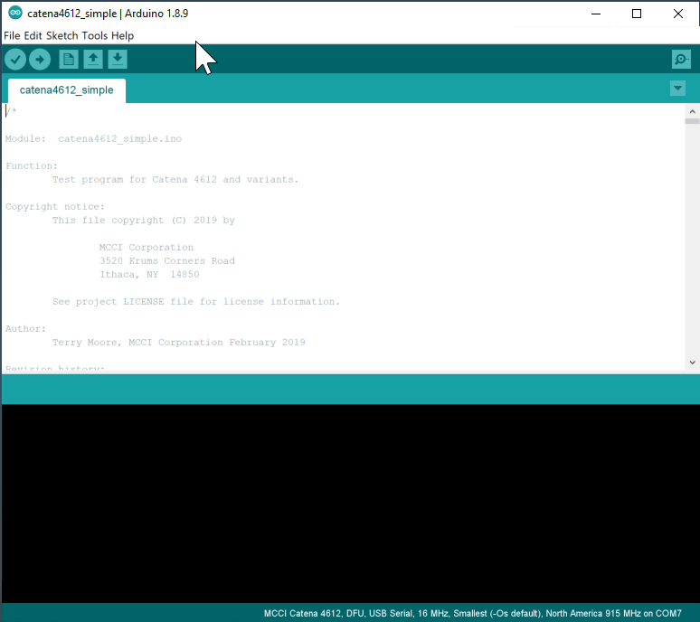

# Catena 4801 Test Sketch
<!-- TOC depthFrom:2 updateOnSave:true -->

- [Introduction](#introduction)
- [Getting Started](#getting-started)
	- [Clone this repository into a suitable directory on your system](#clone-this-repository-into-a-suitable-directory-on-your-system)
	- [Install the MCCI STM32 board support library](#install-the-mcci-stm32-board-support-library)
	- [Select your desired band](#select-your-desired-band)
	- [Select the Serial interface](#select-the-serial-interface)
	- [Installing the required libraries](#installing-the-required-libraries)
		- [List of required libraries](#list-of-required-libraries)
	- [Build and Download](#build-and-download)
	- [Configure Modbus parameters](#configure-modbus-parameters)
	- [Load the sketch into the Catena](#load-the-sketch-into-the-catena)
- [Set the identity of your Catena 4801](#set-the-identity-of-your-catena-4801)
	- [Check platform amd serial number setup](#check-platform-amd-serial-number-setup)
	- [Platform Provisioning](#platform-provisioning)
- [LoRaWAN Provisioning](#lorawan-provisioning)
	- [Preparing the network for your device](#preparing-the-network-for-your-device)
	- [Preparing your device for the network](#preparing-your-device-for-the-network)
	- [Changing registration](#changing-registration)
	- [Starting Over](#starting-over)
- [Notes](#notes)
	- [Setting up ST-Link connection](#setting-up-st-link-connection)
	- [Data Format](#data-format)
	- [gitboot.sh and the other sketches](#gitbootsh-and-the-other-sketches)

<!-- /TOC -->
## Introduction

This sketch demonstrates the MCCI Catena&reg; 4801 as a modbus master to collect data from a modbus device/meter and transmit using a LoRaWAN&reg;-techology network to transmit to a remote server.

The Catena 4801 is a single-board LoRaWAN-enabled modbus host.

Documents on the MCCI Catena 4801 are at https://github.com/mcci-catena/HW-Designs/tree/master/Boards/Catena-4801.

## Getting Started

In order to use this code, you must do several things:

1. Clone this repository into a suitable directory on your system.
2. Install the MCCI Arduino board support package (BSP).
3. Install the required Arduino libraries using `git`.
4. Build the sketch and download to your Catena 4801.

After you have loaded the firmware, you have to set up the Catena 4801.

This sketch uses the Catea-Arduino-Platform library to store critical information on the integrated FRAM. There are several kinds of information. Some things only have to be programmed once in the life of the board; other things must be programmed whenever you change network connections. Entering this information this involves entering Serial commands via the Arduino serial monitor.

- We call information about the 4801 that (theoretically) never changes "identity".
- We call information about the LoRaWAN "provisioning".

### Clone this repository into a suitable directory on your system

This is best done from a command line. You can use a number of techniques, but since you'll need a working git shell, we recommend using the command line.

On Windows, we strongly recommend use of "git bash", available from [git-scm.org](https://git-scm.com/download/win). Then use the "git bash" command line system that's installed by the download.

At the end of this process, you'll have a directory called `{somewhere}/Catena-Sketches`. You get to choose `{somewhere}`. Everyone has their own convention; the author typically has a directory in his home directory called `sandbox`, and then puts projects there.

Once you have a suitable command line open, you can enter the following commands. In the following, change `{somewhere}` to the directory path where you want to put `Catena-Sketches`.

```console
$ cd {somewhere}
$ git clone https://github.com/mcci-catena/Catena-Sketches
Cloning into 'Catena-Sketches'...
remote: Counting objects: 729, done.
remote: Compressing objects: 100% (17/17), done.
remote: Total 729 (delta 15), reused 20 (delta 9), pack-reused 703
Receiving objects: 100% (729/729), 714.26 KiB | 1.25 MiB/s, done.
Resolving deltas: 100% (396/396), done.

$ # get to the right subdirectory
$ cd Catena-Sketches/catena4801_simple

$ # confirm that you're in the right place.
$ ls
catena4801_simple.ino  git-repos.dat  README.md
```

### Install the MCCI STM32 board support library

Open the Arduino IDE. Go to `File>Preferences>Settings`. Add `https://github.com/mcci-catena/arduino-boards/raw/master/BoardManagerFiles/package_mcci_index.json` to the list in `Additional Boards Manager URLs`.

If you already have entries in that list, use a comma (`,`) to separate the entry you're adding from the entries that are already there.

Next, open the board manager. `Tools>Board:...`, and get up to the top of the menu that pops out -- it will give you a list of boards. Search for `MCCI` in the search box and select `MCCI Catena STM32 Boards`. An `[Install]` button will appear to the right; click it.

Then go to `Tools>Board:...` and scroll to the bottom. You should see `MCCI Catena 4801`; select that.

### Select your desired band

When you select a board, the default LoRaWAN region is set to US-915, which is used in North America and much of South America. If you're elsewhere, you need to select your target region. You can do it in the IDE:



As the animation shows, use `Tools>LoRaWAN Region...` and choose the appropriate entry from the menu.

### Select the Serial interface

When you select a board, the default Serial interface is set to `Generic serial`, which only uses first hardware serial of Catena 4801. The RS-485 module in Catena uses the second hardware serial for modbus(RTU) communication. As this sketch uses RS-485 communication, it is necessary to select `Two HW Serial` in Serial interface.

### Installing the required libraries

This sketch uses modbus library.

The script [`git-boot.sh`](https://github.com/mcci-catena/Catena-Sketches/blob/master/git-boot.sh) in the top directory of this repo will get all the things you need.

It's easy to run, provided you're on Windows, macOS, or Linux, and provided you have `git` installed. We tested on Windows with git bash from https://git-scm.org, on macOS 10.11.3 with the git and bash shipped by Apple, and on Ubuntu 16.0.4 LTS (64-bit) with the built-in bash and git from `apt-get install git`.

```console
$ cd Catena-Sketches/catena4801_simple
$ ../git-boot.sh
Cloning into 'Catena-Arduino-Platform'...
remote: Counting objects: 1201, done.
remote: Compressing objects: 100% (36/36), done.
remote: Total 1201 (delta 27), reused 24 (delta 14), pack-reused 1151
Receiving objects: 100% (1201/1201), 275.99 KiB | 0 bytes/s, done.
Resolving deltas: 100% (900/900), done.
...

==== Summary =====
No repos with errors
No repos skipped.
*** no repos were pulled ***
Repos downloaded:      Catena-Arduino-Platform arduino-lorawan Catena-mcciadk arduino-lmic Adafruit_FRAM_I2C Modbus-for-Arduino
```

It has a number of advanced options; use `../git-boot.sh -h` to get help, or look at the source code [here](https://github.com/mcci-catena/Catena-Sketches/blob/master/git-boot.sh).

**Beware of issue #18**.  If you happen to already have libraries installed with the same names as any of the libraries in `git-repos.dat`, `git-boot.sh` will silently use the versions of the library that you already have installed. (We hope to soon fix this to at least tell you that you have a problem.)

#### List of required libraries

This sketch depends on the following libraries.

*  https://github.com/mcci-catena/Catena-Arduino-Platform
*  https://github.com/mcci-catena/arduino-lorawan
*  https://github.com/mcci-catena/Catena-mcciadk
*  https://github.com/mcci-catena/arduino-lmic
*  https://github.com/mcci-catena/Adafruit_FRAM_I2C
*  https://github.com/mcci-catena/Modbus-for-Arduino

### Build and Download

Shutdown the Arduino IDE and restart it, just in case.

Ensure selected board is 'MCCI Catena 4801' (in the GUI, check that `Tools`>`Board "..."` says `"MCCI Catena 4801"`.

In the IDE, use File>Open to load the `catena4801_simple.ino` sketch. (Remember, in step 1 you cloned `Catena-Sketches` -- find that, and navigate to `{somewhere}/Catena-Sketches/catena4801_simple/`)

Follow normal Arduino IDE procedures to build the sketch: `Sketch`>`Verify/Compile`. If there are no errors, go to the next step.

### Configure Modbus parameters

To communicate with the Modbus slave, it is necessary to modify the Modbus slave parameter in the `setup_modbus` function as it matches the device parameters.

```
/* Modbus slave parameters */
u8addr = 65;			// current target device: 01
u8fct = 03;			// Function code
u16RegAdd = 00;			// start address in device
u16CoilsNo = 13;		// number of elements (coils or registers) to read
host.begin(&mySerial, 9600);	// baud-rate at 9600
```

Connect your modbus slaves A and B terminal to Catena 4801s A and B terminal (JP3).

### Load the sketch into the Catena

Make sure the correct port is selected in `Tools`>`Port`.

Load the sketch into the Catena using `Sketch`>`Upload` and move on to provisioning.

## Set the identity of your Catena 4801

This can be done with any terminal emulator, but it's easiest to do it with the serial monitor built into the Arduino IDE or with the equivalent monitor that's part of the Visual Micro IDE. It can also be done usign Tera Term.

### Check platform amd serial number setup


At the bottom right side of the serial monitor window, set the dropdown to `Newline` and `115200 baud`.

Enter the following command, and press enter:

```
system configure platformguid
```

If the Catena is functioning at all, you'll either get an error message, or you'll get a long number like:

```
10ea7e25-a4a4-45fd-8959-c04a6a5d7f95
```

(Several numbers are possible.)

If you get an error message, please follow the **Platform Provisioning** instructions. Otherwise, skip to **LoRAWAN Provisioning**.

### Platform Provisioning

The Catena 4801 has a number of build options. We have a single firmware image to support the various options. The firmware learns the build options using the platform GUID data stored in the FRAM, so if the factory settings are not present or have been lost, you need to do the following.

If your Catena 4801 is fresh from the factory, you will need to enter the following commands.

- <code>system configure syseui <strong><em>serialnumber</em></strong></code>

You will find the serial number on the bottom of the Catena 4801 PCB. It will be a 16-digit number of the form `00-02-cc-01-xx-xx-xx-xx`. If you can't find a serial number, please contact MCCI for assistance.

Continue by entering the following commands.

- `system configure operatingflags 1`
- `system configure platformguid 10ea7e25-a4a4-45fd-8959-c04a6a5d7f95`

The operating flags control a number of features of the sketch and of the underlying platform. Values are given in the README for Catena-Arduino-Platform.

## LoRaWAN Provisioning

Some background: with LoRaWAN, you have to create a project on your target network, and then register your device with that project.

Somewhat confusingly, the LoRaWAN specification uses the word "application" to refer to the group of devices in a project. We will therefore follow that convention. It's likely that your network provider follows that convention too.

We'll be setting up the device for "over the air authentication" (or OTAA).

### Preparing the network for your device

For OTAA, we'll need to load three items into the device. (We'll use Serial to load them in -- you don't have to edit any code.)  These items are:

1. *The device extended unique identifier, or "devEUI"*. This is a 8-byte number.

   For convenience, MCCI assigns a unique identifier to each Catena; you should be able to find it on a printed label on your device. It will be a number of the form "00-02-cc-01-??-??-??-??".

2. *The application extended unique identifier, or "AppEUI"*. This is also an 8-byte number.

3. *The application key, or "AppKey"*. This is a 16-byte number.

If you're using The Things Network as your network provider, see the notes in the separate file in this repository: [Getting Started with The Things Network](../extra/Getting-Started-With-The-Things-Network.md). This walks you through the process of creating an application and registering a device. During that process, you will input the DevEUI (we suggest using the serial number printed on the Catena). At the end of the process, The Things Network will supply you with the required AppEUI and Application Key.

For other networks, follow their instructions for determining the DevEUI and getting the AppEUI and AppKey.

### Preparing your device for the network

Make sure your device is still connected to the Arduino IDE, and make sure the serial monitor is still open. (If needed, open it using Tools>Serial Monitor.)

Enter the following commands in the serial monitor, substituting your _`DevEUI`_, _`AppEUI`_, and _`AppKey`_, one at a time.

- <code>lorawan configure deveui <em>DevEUI</em></code>
- <code>lorawan configure appeui <em>AppEUI</em></code>
- <code>lorawan configure appkey <em>AppKey</em></code>
- <code>lorawan configure join 1</code>

After each command, you will see an `OK`.

<!--  -->

Then reboot your Catena using the command `system reset`. If you're using the Aruidno environment on Windows, you will have to close and re-open the serial monitor after resetting the Catena.

You should then see a series of messages including:

```console
EV_JOINED
NetId ...
```

### Changing registration

Once your device has joined the network, it's somewhat painful to unjoin.

You need to enter a number of commands:

- `lorawan configure appskey 0`
- `lorawan configure nwkskey 0`
- `lorawan configure fcntdown 0`
- `lorawan configure fcntup 0`
- `lorawan configure devaddr 0`
- `lorawan configure netid 0`
- `lorawan configure join 0`

Then reset your device, and repeat [LoRaWAN Provisioning](#lorawan-provisioning) above.

### Starting Over

If all the typing in [Changing registration](#changing-registration) is too painful, or if you're in a real hurry, you can simply reset the Catena's non-volatile memory to it's initial state. The command for this is:

- `fram reset hard`

Then reset your Catena, and return to [Provision your Catena 4801](#provision-your-catena-4801).

## Notes

### Setting up ST-Link connection

Catena 4801 uses ST-Link V2 programmer for programming the firmware. Below is the connection between 4801 and ST-Link programmer


Catena 4801 (JP1) | ST-Link
----------------- | -------
+VDD | Pin 1
GND | Pin 3
SWCLK | Pin 9
SWDIO | Pin 7
nRST | Pin 15

### Data Format

Refer to the [Protocol Description](../extra/catena-message-0x15-format.md) in the `extras` directory for information on how data is encoded.

### gitboot.sh and the other sketches

Many of the sketches in other directories in this tree are for engineering use at MCCI. The `git-repos.dat` file in this directory does not necessarily install all the required libraries needed for building the other directories. However, many sketches have a suitable `git-repos.dat`. In any case, all the libraries should be available from https://github.com/mcci-catena/; and we are working on getting `git-repos.dat` files in every sub-directory.
