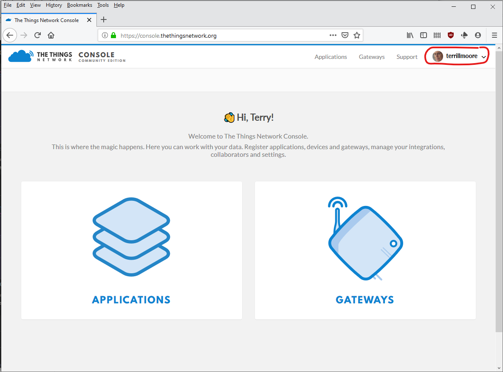
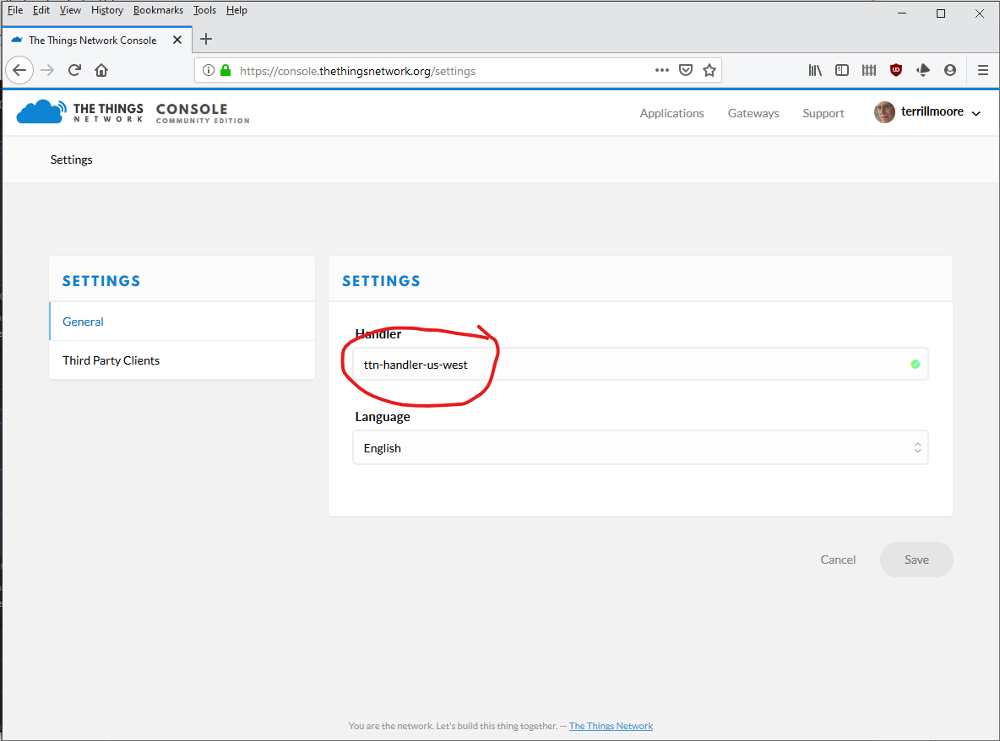
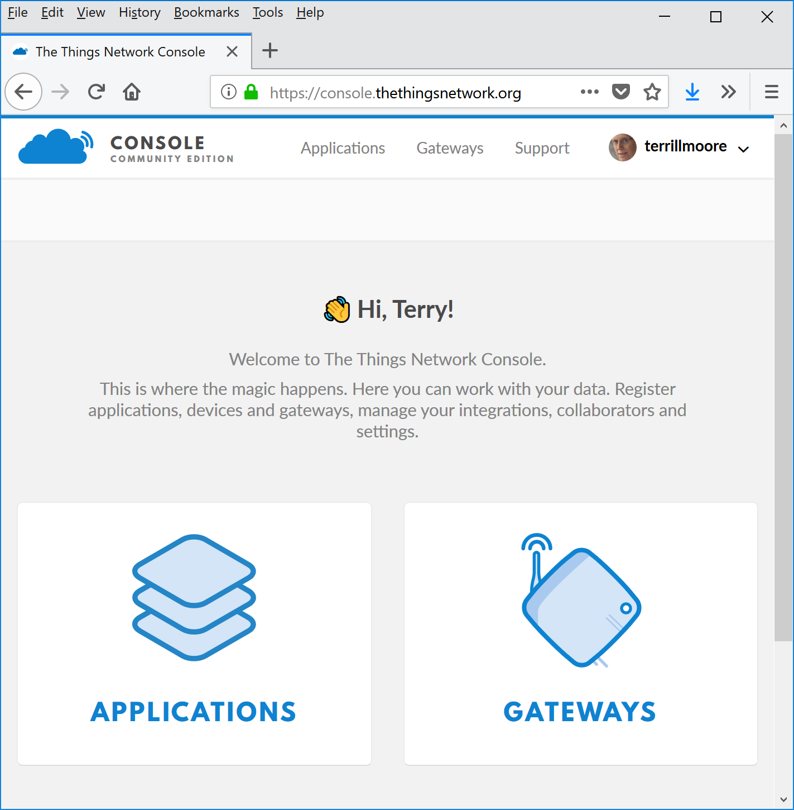
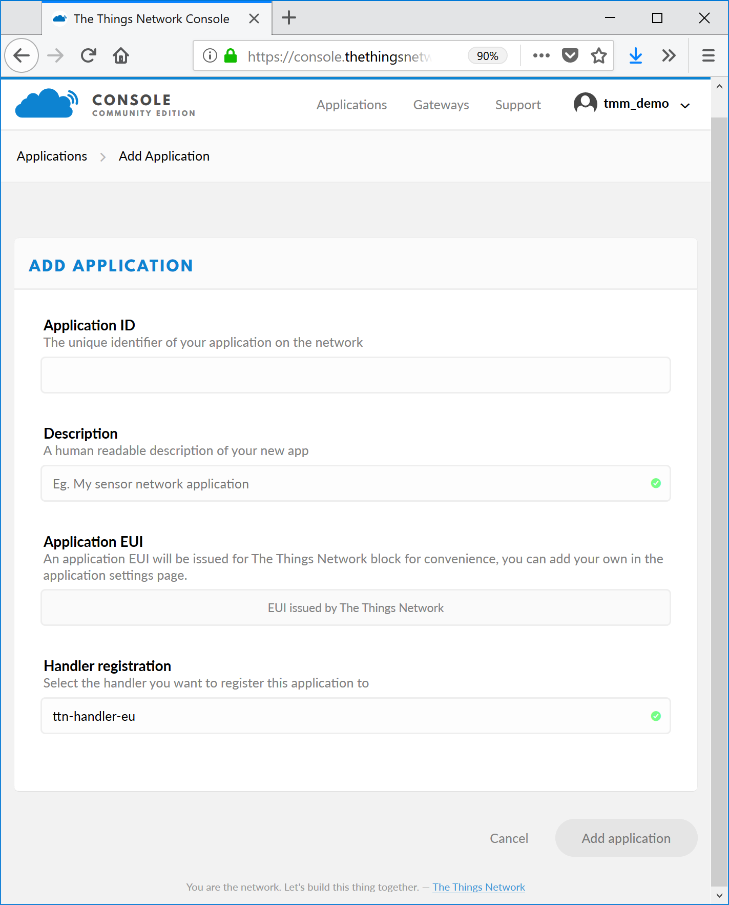
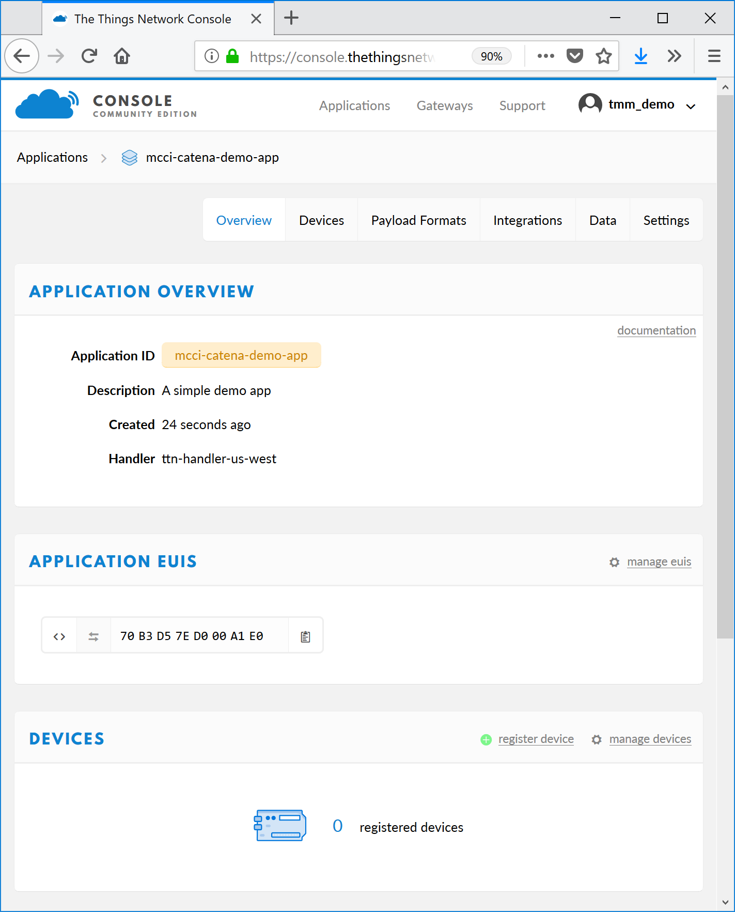
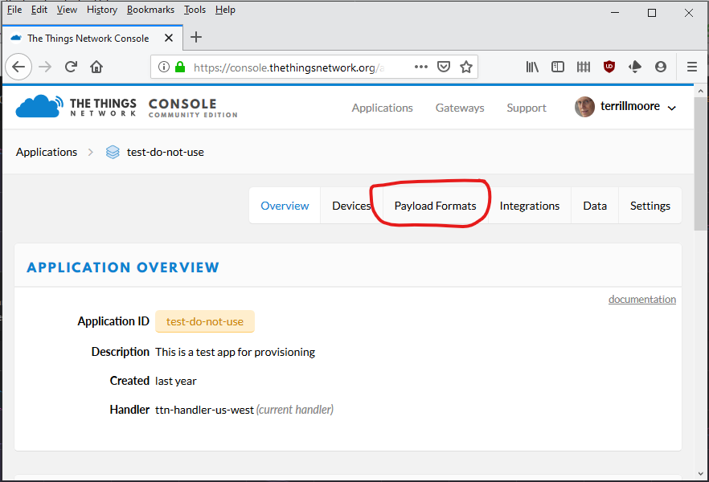
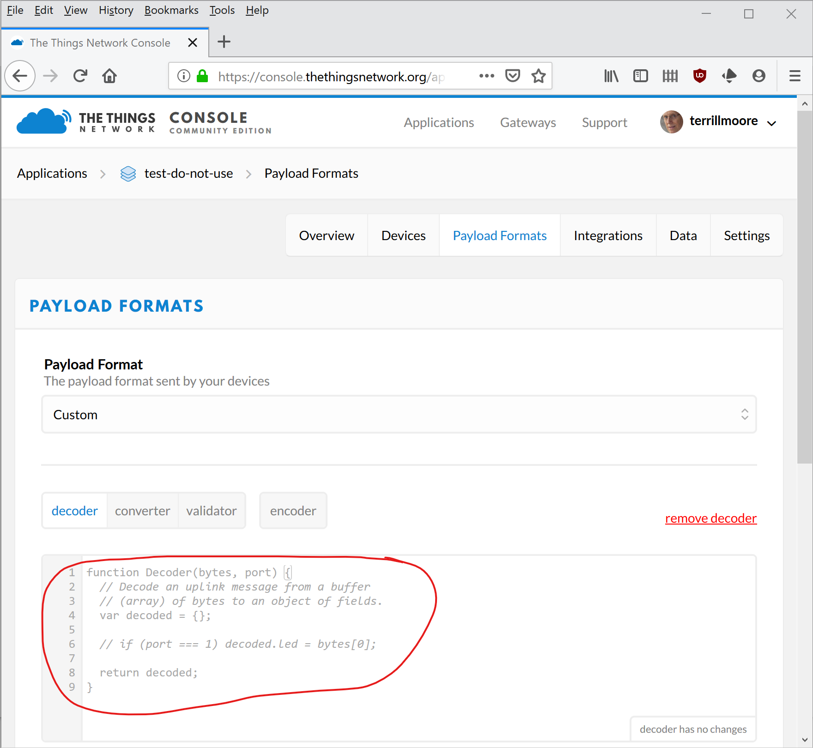
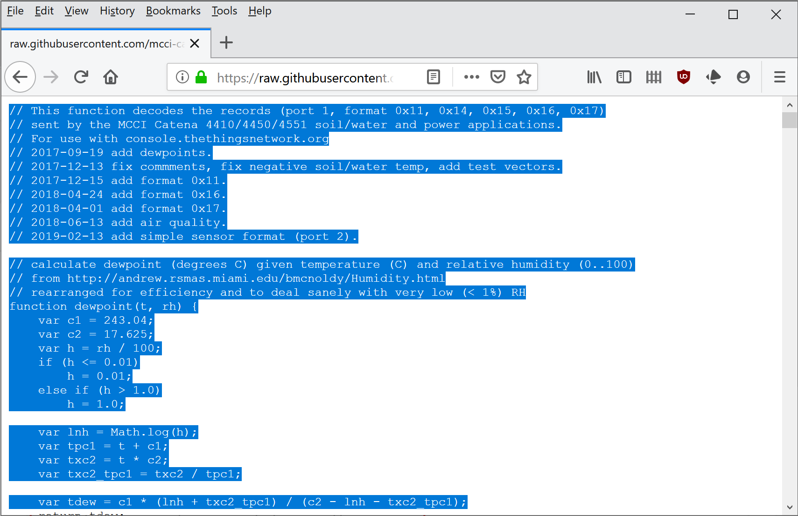
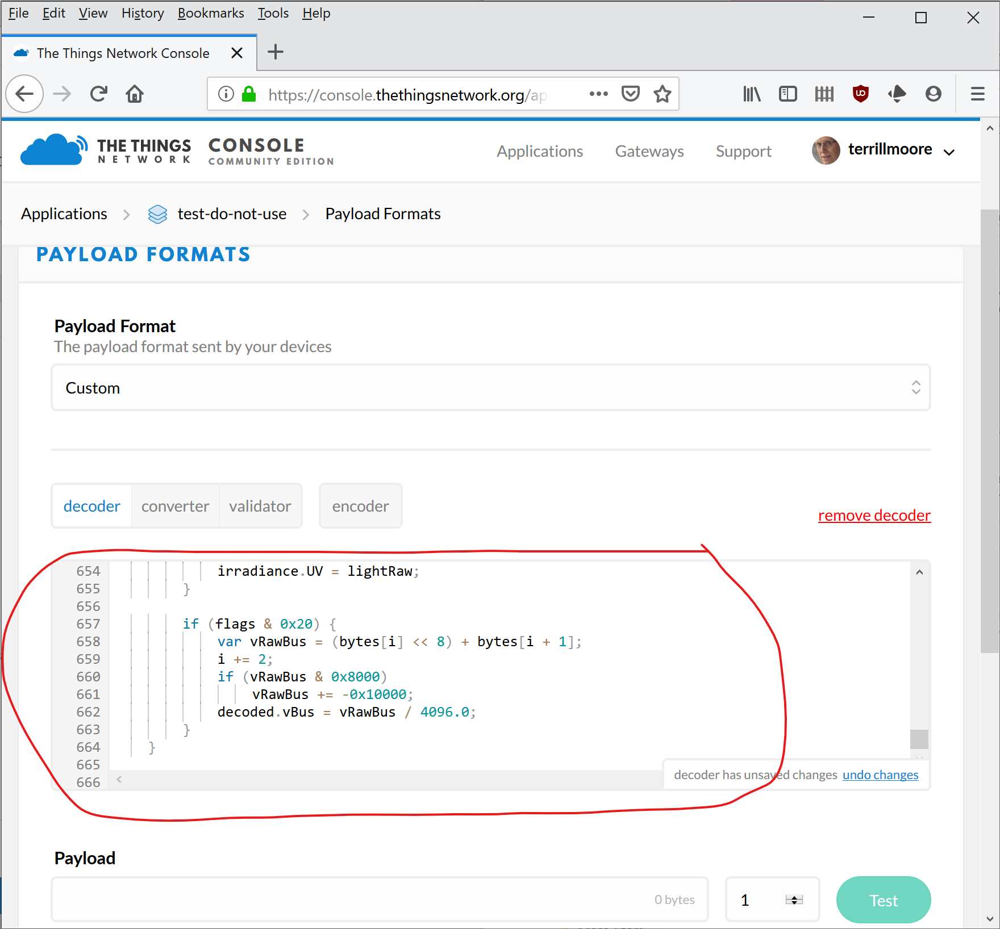
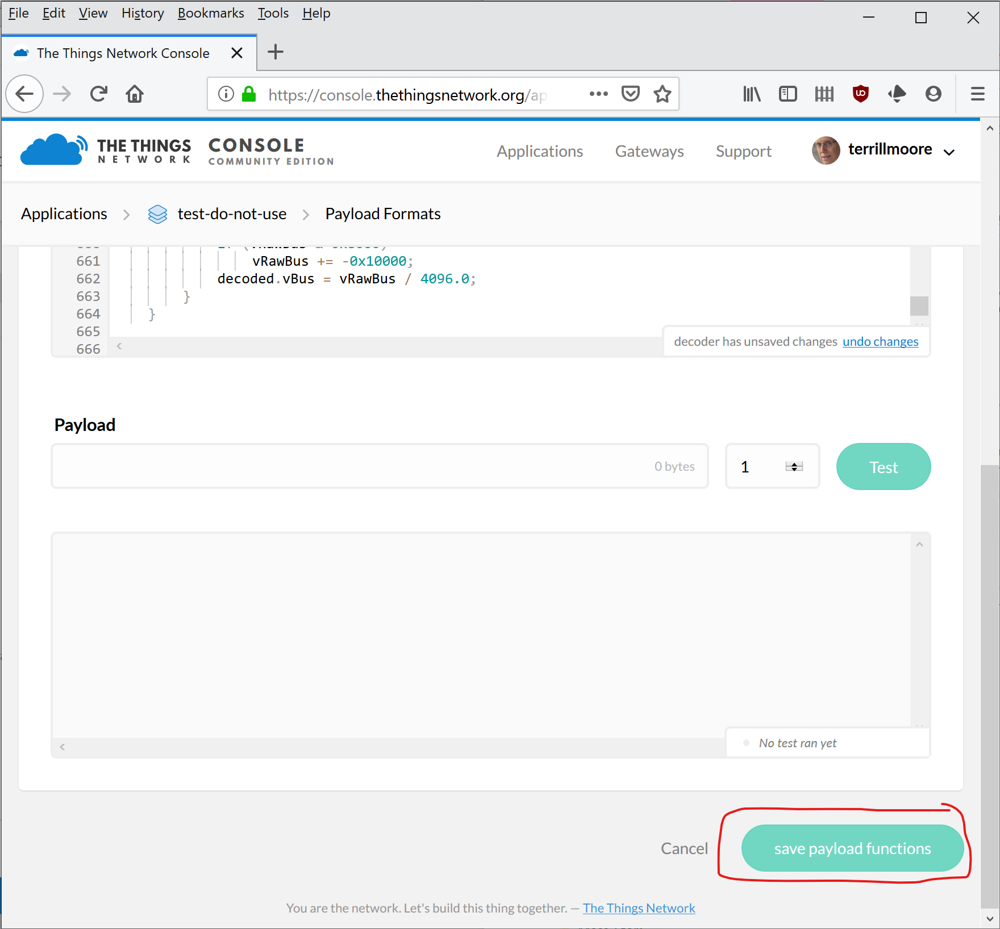

# Getting Started with The Things Network
<!-- TOC depthFrom:2 updateOnSave:true -->

- [Create an account (if necessary)](#create-an-account-if-necessary)
- [Create an application](#create-an-application)
- [Add your device to the application](#add-your-device-to-the-application)
- [Add a protocol decoder to the application](#add-a-protocol-decoder-to-the-application)

<!-- /TOC -->
## Create an account (if necessary)

Go to https://console.thethingsnetwork.org and follow the instructions to create an account.

After creating your account, go to settings, and change your handler. To open the settings page, click here:

Then make sure "**ttn-handler-us-west**" is selected under "**Handler**".

## Create an application

After you create an account, you'll see this screen.

You have two choices:

- Applications
- Gateways

Click on Applications, and you'll see the following.

Click on "Get started by adding one" (or "Create a new application" if you already have one).

The first entry ("Application ID") is the unique name for your application/project. This name is used in some APIs as part of URLs, so it must follow DNS rules: it may consist only of lower-case letters, digits, and the hyphen or dash (`-`) character. For example, `sensor-project-1` is valid, but `My great project!` is not.

The second entry ("Description") is the description of your project.

The third entry is not changed by you.

The fourth entry (Handler registration) selects the router for your project. If you're in US, click in the box (left of the green check-mark), and scroll down to `ttn-handler-us-west`.

Then click "Add application".

## Add your device to the application

You should see the following screen.

Click on "register device" (to the right of DEVICES), and you'll see the following:

The first field ("Device ID") is again a DNS-like name. It consists of lower-case digits, numbers and dashes, and it must not begin or end with a dash.

For the second field ("Device EUI") you have two choices.

- you can use the EUI from the printed label on your Catena, or
- you can ask console to generate an EUI for you.

Ignore the final two fields, and click "Register" at the bottom.

## Add a protocol decoder to the application

Select your application, then at the top find the **Payload Formats** button. (You might have to scroll up.)

The page will look like this.

Leave that window open, and open the [TTN generic decoder](https://raw.githubusercontent.com/mcci-catena/Catena-Sketches/master/extra/catena-message-generic-decoder-ttn.js) on github in raw mode, and copy the script with your web browser.

Go back to the TTN Console window, delete the current contents, and paste the decoder script.

Finally, be sure to scroll to the bottom of the page and press "Save".

