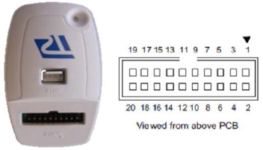
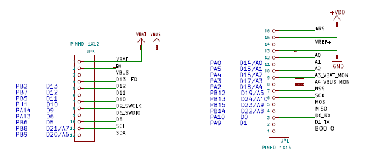
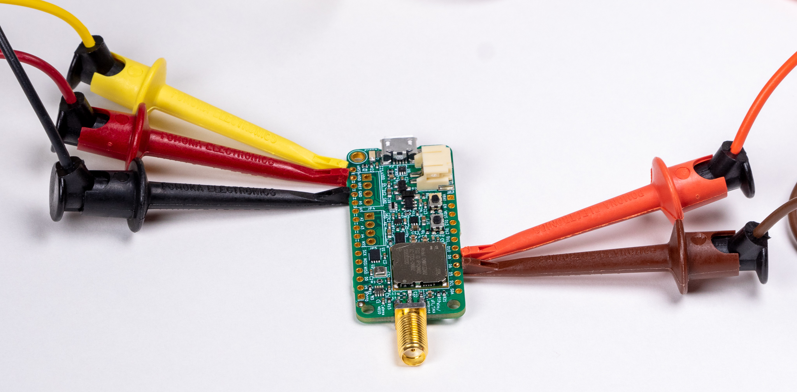
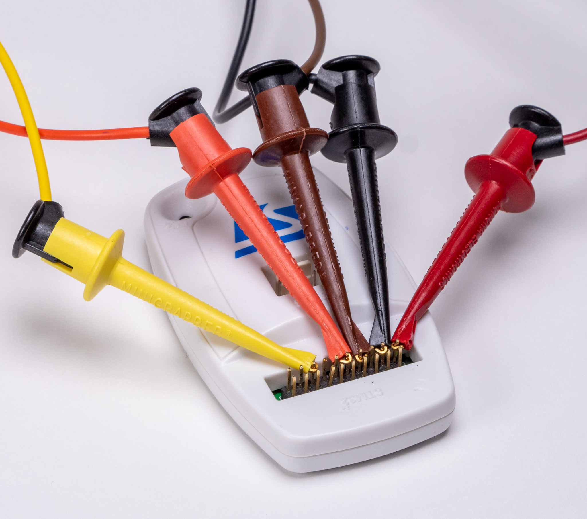

# How to Debug STM32-based MCCI Catena&reg; Boards with Arduino and ST-LINK

<!--
  This TOC uses the VS Code markdown TOC extension AlanWalk.markdown-toc.
  We strongly recommend updating using VS Code, the markdown-toc extension and the
  bierner.markdown-preview-github-styles extension. Note that if you are using
  VS Code 1.29 and Markdown TOC 1.5.6, https://github.com/AlanWalk/markdown-toc/issues/65
  applies -- you must change your line-ending to some non-auto value in Settings>
  Text Editor>Files.  `\n` works for me.
-->
<!-- markdownlint-disable MD033 MD004 -->
<!-- markdownlint-capture -->
<!-- markdownlint-disable -->
<!-- TOC depthFrom:2 updateOnSave:true -->

- [Introduction](#introduction)
- [Required Software](#required-software)
- [Setup with 4610](#setup-with-4610)
- [Setting up `st-util`](#setting-up-st-util)
- [Build your sketch](#build-your-sketch)
- [Download and debug](#download-and-debug)
	- [Windows](#windows)
	- [Linux](#linux)

<!-- /TOC -->
<!-- markdownlint-restore -->
<!-- Due to a bug in Markdown TOC, the table is formatted incorrectly if tab indentation is set other than 4. Due to another bug, this comment must be *after* the TOC entry. -->

## Introduction

This document describes how to set up to do source-level debugging with MCCI Catena boards based on the STM32 MCU, using the inexpensive STLINK-V2 debugger.

This document assumes you're familiar with `gdb`, and with the concepts underlying two-machine debugging.

We're following the procedure posted on Hackaday by Al Williams: [The $2 32-Bit Arduino (with Debugging)](https://hackaday.com/2017/03/30/the-2-32-bit-arduino-with-debugging/).  There's an accompanying [YouTube video](https://youtu.be/D-MbC9N5U7o) that is very helpful.

The connection scheme varies depending on the boards. For Feather-compatible MCCI boards, the layout is as follows.

## Required Software

Install the `stlink` software page from [`github.com/texane/stlink`](https://github.com/texane/stlink).

Make sure you have V2.6.0 or later of the MCCI Arduino STM32 IDE. (Or edit your `platform.txt` file to add `-g` after `-c` in the commands `compiler.S.flags=`, `compiler.cpp.flags=`, and `compiler.S.flags=`.)

## Setup with 4610

Attach an ST-LINK-2 to the SWD pins of the 46xx using jumpers.

   .

   | 46xx Pin  |  46xx Label   | ST-Link Pin | Color
   |:---------:|:-------------:|:-----------:|----------
   |   JP1-15  |    `+VDD`     |      1      |  Red
   |   JP1-13  |     `GND`     |      3      |  Black
   |   JP2-9   |  `D6 SWDIO`   |      7      |  Brown
   |   JP2-8   |  `D9 SWDCLK`  |      9      |  Orange
   |   JP1-16  |    `nRST`     |     15      |  Yellow

   Note that these are almost linear; only 9 and 7 on the ST-Link are swapped.

   Catena 4610 pinout for reference:

   

Here are pictures of the setup.

   Catena 4610  |   STLINK V2
:--------------:|:------------:
 | 

## Setting up `st-util`

The `st-util` tool connects to the STLINK, and exports a local TCP socket compatible with GDB. Before running the tool, make sure the target is properly connected to the STLINK, and also make sure that the STLINK is connected to the PC using a USB cable. (It's possible to use a different system as the STLINK server, but that's beyond the scope of this document.)

1. On Windows, download V1.30 of the tools from the [GitHub release page](https://github.com/texane/stlink/releases/tag/1.3.0). I placed the files in `c:\stlink`, and rearranged so that the executables were in `c:\stlink\bin`.

   On Ubuntu Linux, I followed the instructions to build and install:

   ```bash
   sudo apt install cmake
   sudo apt install libgtk-3-dev
   cd sandbox/
   git clone git@github.com:texane/stlink.git
   cd stlink/
   make release
   cd build/Release/
   sudo make install
   cd ../..
   sudo cp -p etc/udev/rules.d/* /etc/udev/rules.d/
   sudo udevadm control --reload-rules
   sudo udevadm trigger
   ```

2. From a command window, start the `st-util` utility. You can choose whatever port you like; we'll use `1234`.

   From git bash, use `winpty`:

   ```console
   $ winpty /c/stlink/bin/st-util.exe -p 1234
   st-util 1.3.0
   2019-09-06T15:05:35 INFO C:\Users\Jerry\Desktop\stlink-master\src\common.c: Loading device parameters....
   2019-09-06T15:05:35 INFO C:\Users\Jerry\Desktop\stlink-master\src\common.c: Device connected is: L0x Category 5 device, id 0x20086447
   2019-09-06T15:05:35 INFO C:\Users\Jerry\Desktop\stlink-master\src\common.c: SRAM size: 0x5000 bytes (20 KiB), Flash: 0x30000 bytes (192 KiB) in pages of 128 bytes
   2019-09-06T15:05:35 INFO C:\Users\Jerry\Desktop\stlink-master\src\gdbserver\gdb-server.c: Chip ID is 00000447, Core ID is  0bc11477.
   2019-09-06T15:05:35 INFO C:\Users\Jerry\Desktop\stlink-master\src\gdbserver\gdb-server.c: Listening at *:1234...
   ```

## Build your sketch

1. Build your sketch with verbose logging turned on. I have used both the Arduino IDE and Visual Studio Code. Both work fine, provided that you turn on verbose logging.

2. Examine the log to find the **_build directory_** and the **_path to the C compiler and tools_**.

   ```console
   Using library arduino-lmic at version 3.0.99 in folder: C:\Users\tmm\Documents\Arduino\libraries\arduino-lmic
   Using library SPI at version 1.0 in folder: C:\Users\tmm\AppData\Local\Arduino15\packages\mcci\hardware\stm32\2.4.0\libraries\SPI
   "C:\\Users\\tmm\\AppData\\Local\\Arduino15\\packages\\mcci\\tools\\arm-none-eabi-gcc\\6-2017-q2-update/bin/arm-none-eabi-size" -A "c:\\tmp\\build-vscode-lmic/compliance-otaa-halconfig.ino.elf"
   Sketch uses 51680 bytes (26%) of program storage space. Maximum is 196608 bytes.
   Global variables use 8880 bytes (43%) of dynamic memory, leaving 11600 bytes for local variables. Maximum is 20480 bytes.
   [Done] Finished verify sketch - examples\compliance-otaa-halconfig\compliance-otaa-halconfig.ino
   ```

   From the above, the path to the tools is: `C:\\Users\\tmm\\AppData\\Local\\Arduino15\\packages\\mcci\\tools\\arm-none-eabi-gcc\\6-2017-q2-update/bin`

   And the path to the build directory (where your sketch .elf file was created): `c:\\tmp\\build-vscode-lmic/compliance-otaa-halconfig.ino.elf`.

## Download and debug

Now we need to launch GDB, tell it to connect to the target, download the code, and finally run the sketch.

In a second command window (leaving `st-util` running in the first window), run `arm-none-eabi-gdb`, pointing at the target script.change directory to where your sketch was created.

### Windows

```console
C:\tmp\build-vscode-lmic> \Users\tmm\AppData\Local\arduino15\packages\mcci\tools\arm-none-eabi-gcc\6-2017-q2-update\bin\arm-none-eabi-gdb.exe compliance-otaa-halconfig.ino.elf
GNU gdb (GNU Tools for ARM Embedded Processors 6-2017-q2-update) 7.12.1.20170417-git
Copyright (C) 2017 Free Software Foundation, Inc.
License GPLv3+: GNU GPL version 3 or later <http://gnu.org/licenses/gpl.html>
This is free software: you are free to change and redistribute it.
There is NO WARRANTY, to the extent permitted by law.  Type "show copying"
and "show warranty" for details.
This GDB was configured as "--host=i686-w64-mingw32 --target=arm-none-eabi".
Type "show configuration" for configuration details.
For bug reporting instructions, please see:
<http://www.gnu.org/software/gdb/bugs/>.
Find the GDB manual and other documentation resources online at:
<http://www.gnu.org/software/gdb/documentation/>.
For help, type "help".
Type "apropos word" to search for commands related to "word"...
Reading symbols from compliance-otaa-halconfig.ino.elf...(no debugging symbols found)...done.
(gdb) target extended-remote  :1234
Remote debugging using :1234
0x08009f38 in spi_init ()
(gdb) load
Loading section .isr_vector, size 0xc0 lma 0x8000000
Loading section .text, size 0xbc14 lma 0x80000c0
Loading section .rodata, size 0xcec lma 0x800bcd4
Loading section .ARM, size 0x8 lma 0x800c9c0
Loading section .init_array, size 0x30 lma 0x800c9c8
Loading section .fini_array, size 0x4 lma 0x800c9f8
Loading section .data, size 0xe0 lma 0x800c9fc
Start address 0x8009f64, load size 51932
Transfer rate: 3 KB/sec, 5193 bytes/write.
(gdb)
```

### Linux

TUI debugging is not supported in the Windows tools. However it is enabled in Linux. So we can use the `--tui` option.

```console
$ ~/.arduino15/packages/mcci/tools/arm-none-eabi-gcc/6-2017-q2-update/bin/arm-none-gdb --tui /tmp/arduino_build_325049/compliance-otaa-halconfig.ino.elf
...
(gdb) target extended-remote :1234
(gdb) load
(gdb) cont
```
