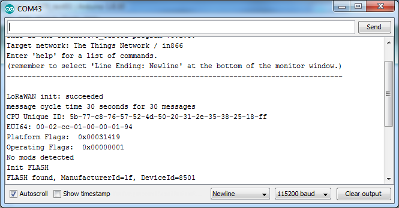

# How to Provision your Catena device
<!-- TOC depthFrom:2 updateOnSave:true -->

- [Set the identity of your Catena node](#set-the-identity-of-your-catena-node)
	- [Check platform amd serial number setup](#check-platform-amd-serial-number-setup)
	- [Platform Provisioning](#platform-provisioning)
- [LoRaWAN Provisioning](#lorawan-provisioning)
	- [Preparing the network for your device](#preparing-the-network-for-your-device)
	- [Preparing your device for the network](#preparing-your-device-for-the-network)
	- [Changing registration](#changing-registration)
	- [Starting Over](#starting-over)

<!-- /TOC -->
## Set the identity of your Catena node

This can be done with any terminal emulator, but it's easiest to do it with the serial monitor built into the Arduino IDE or with the equivalent monitor that's part of the Visual Micro IDE. It can also be done usign Tera Term.

### Check platform amd serial number setup



At the bottom right side of the serial monitor window, set the dropdown to `Newline` and `115200 baud`.

Enter the following command, and press enter:

```
system configure platformguid
```

If the Catena is functioning at all, you'll either get an error message, or you'll get a long number like:

```
915decfa-d156-4d4f-bac5-70e7724726d8
```

(Several numbers are possible.)

If you get an error message, please follow the **Platform Provisioning** instructions. Otherwise, skip to **LoRAWAN Provisioning**.

### Platform Provisioning

The Catena device has a number of build options. We have a single firmware image to support the various options. The firmware learns the build options using the platform GUID data stored in the FRAM, so if the factory settings are not present or have been lost, you need to do the following.

If your Catena device is fresh from the factory, you will need to enter the following commands.

- <code>system configure syseui <strong><em>serialnumber</em></strong></code>

You will find the serial number on the bottom of the Catena node PCB. It will be a 16-digit number of the form `00-02-cc-01-xx-xx-xx-xx`. If you can't find a serial number, please contact MCCI for assistance.

Continue by entering the following commands.

- `system configure operatingflags 1`
- `system configure platformguid 915decfa-d156-4d4f-bac5-70e7724726d8`

NOTE: Platform GUID provided here is for an example and it varies with Catena boards and to their application. You will be provided with respective platform GUID during the purchase of your Catena boards.

You can also find the platform GUID in the [Catena_Guids.h](https://github.com/mcci-catena/Catena-Arduino-Platform/blob/master/src/Catena_Guids.h) of library Catena-Arduino-Platform for your Catena boards.

The operating flags control a number of features of the sketch and of the underlying platform. Values are given in the README for Catena-Arduino-Platform.

## LoRaWAN Provisioning

Some background: with LoRaWAN, you have to create a project on your target network, and then register your device with that project.

Somewhat confusingly, the LoRaWAN specification uses the word "application" to refer to the group of devices in a project. We will therefore follow that convention. It's likely that your network provider follows taht convention too.

We'll be setting up the device for "over the air authentication" (or OTAA).

### Preparing the network for your device

For OTAA, we'll need to load three items into the device. (We'll use USB to load them in -- you don't have to edit any code.)  These items are:

1. *The device extended unique identifier, or "devEUI"*. This is a 8-byte number.

   For convenience, MCCI assigns a unique identifier to each Catena; you should be able to find it on a printed label on your device. It will be a number of the form "00-02-cc-01-??-??-??-??".

2. *The application extended unique identifier, or "AppEUI"*. This is also an 8-byte number.

3. *The application key, or "AppKey"*. This is a 16-byte number.

If you're using The Things Network as your network provider, see the notes in the separate file in this repository: [Getting Started with The Things Network](../extra/Getting-Started-With-The-Things-Network.md). This walks you through the process of creating an application and registering a device. During that process, you will input the DevEUI (we suggest using the serial number printed on the Catena). At the end of the process, The Things Network will supply you with the required AppEUI and Application Key.

For other networks, follow their instructions for determining the DevEUI and getting the AppEUI and AppKey.

### Preparing your device for the network

Make sure your device is still connected to the Arduino IDE, and make sure the serial monitor is still open. (If needed, open it using Tools>Serial Monitor.)

Enter the following commands in the serial monitor, substituting your _`DevEUI`_, _`AppEUI`_, and _`AppKey`_, one at a time.

- <code>lorawan configure deveui <em>DevEUI</em></code>
- <code>lorawan configure appeui <em>AppEUI</em></code>
- <code>lorawan configure appkey <em>AppKey</em></code>
- <code>lorawan configure join 1</code>

After each command, you will see an `OK`.

<!--  -->

Then reboot your Catena using the command `system reset`. If you're using the Aruidno environment on Windows, you will have to close and re-open the serial monitor after resetting the Catena.

You should then see a series of messages including:

```console
EV_JOINED
NetId ...
```

### Changing registration

Once your device has joined the network, it's somewhat painful to unjoin.

You need to enter a number of commands:

- `lorawan configure appskey 0`
- `lorawan configure nwkskey 0`
- `lorawan configure fcntdown 0`
- `lorawan configure fcntup 0`
- `lorawan configure devaddr 0`
- `lorawan configure netid 0`
- `lorawan configure join 0`

Then reset your device, and repeat [LoRaWAN Provisioning](#lorawan-provisioning) above.

### Starting Over

If all the typing in [Changing registration](#changing-registration) is too painful, or if you're in a real hurry, you can simply reset the Catena's non-volatile memory to it's initial state. The command for this is:

- `fram reset hard`

Then reset your Catena, and return to [Provision your Catena](#set-the-identity-of-your-catena-node).